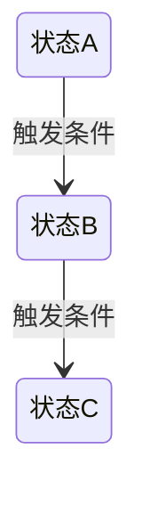

## 设计目标
<这份设计要解决什么问题，达到什么效果>

## 用户场景
<描述典型用户的使用场景，1-2个具体场景>

## 功能设计

### 功能点 1：<功能名>
**用户操作**：<用户做什么>
**系统响应**：<系统做什么>
**界面要素**：<界面上有什么>

### 功能点 2：<功能名>
...

## 数据契约
<agent 执行所需的数据结构定义>

```yaml
# 示例：输入数据契约
input:
  field1: <类型> # 说明
  field2: <类型> # 说明

# 示例：输出数据契约
output:
  field1: <类型> # 说明
```

## 状态与流转
<涉及哪些状态，状态之间如何流转>



## 边界与异常
- **边界条件1**：<描述> → <处理方式>
- **异常情况1**：<描述> → <处理方式>

## 执行规则
<agent 执行这个功能时必须遵守的规则>
1. <规则1>
2. <规则2>

## 与其他模块的交互
- **依赖**：<本设计依赖哪些模块/接口>
- **被依赖**：<哪些模块会用到本设计的产出>

## 待研发确认事项
- [ ] <需要研发确认的技术可行性问题1>
- [ ] <问题2>

## 变更记录
| 日期 | 变更人 | 变更内容 |
|---|---|---|
| YYYY-MM-DD | <姓名> | 初稿 |
